# Marmilo / Brush Architecture Guide

This repository currently contains two main pieces:

- The Unity client app in `/Assets`
- The backend in `/Marmilo.Backend`

This document focuses on the Unity-side architecture, the communication patterns it uses, and the places where the ongoing migration to server-backed state is already visible.

For backend details, see [Marmilo.Backend/README.md](/Volumes/DiegoMac2/Diego/projects/Brush/Marmilo.Backend/README.md).

## Big Picture

At a high level, the client is organized around:

- `SceneBase`-driven screens
- Zenject composition and dependency injection
- An event-driven interaction model using `EventDispatcher`
- Thin controllers and view components in Unity
- Data/state services in `Game.Core`
- Reusable infrastructure in `Utilities`
- A new remote communication stack for Marmilo backend access

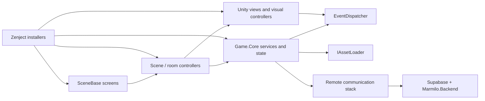

## Most Important Classes

These are the classes that currently define the shape of the client runtime:

- [GameProjectInstaller.cs](/Volumes/DiegoMac2/Diego/projects/Brush/Assets/Scripts/Game/Unity/Installers/GameProjectInstaller.cs): global Zenject bindings
- [GameProjectComposition.cs](/Volumes/DiegoMac2/Diego/projects/Brush/Assets/Scripts/Game/Unity/Installers/GameProjectComposition.cs): DI-agnostic object creation and bootstrap helpers
- [SceneBase.cs](/Volumes/DiegoMac2/Diego/projects/Brush/Assets/Scripts/Game/Unity/Scenes/SceneBase.cs): base class for navigable screens
- [GameNavigationService.cs](/Volumes/DiegoMac2/Diego/projects/Brush/Assets/Scripts/Game/Unity/Scenes/GameNavigationService.cs): game-facing navigation orchestration
- [NavigationService.cs](/Volumes/DiegoMac2/Diego/projects/Brush/Assets/Scripts/Utilities/Unity/Navigation/Core/NavigationService.cs): generic scene/popup navigator
- [EventDispatcher.cs](/Volumes/DiegoMac2/Diego/projects/Brush/Assets/Scripts/Utilities/Core/Events/EventDispatcher.cs): event bus
- [DataRepository.cs](/Volumes/DiegoMac2/Diego/projects/Brush/Assets/Scripts/Game/Core/Services/DataRepository.cs): transitional gameplay state facade
- [ClientGameStateStore.cs](/Volumes/DiegoMac2/Diego/projects/Brush/Assets/Scripts/Game/Core/Services/ClientGameStateStore.cs): local client-side UI cache/store
- [DataController.cs](/Volumes/DiegoMac2/Diego/projects/Brush/Assets/Scripts/Game/Core/DataController/DataController.cs): translates room events into repository writes
- [IAssetLoader.cs](/Volumes/DiegoMac2/Diego/projects/Brush/Assets/Scripts/Utilities/Unity/AssetLoader/IAssetLoader.cs) and [AddressablesAssetLoader.cs](/Volumes/DiegoMac2/Diego/projects/Brush/Assets/Scripts/Utilities/Unity/AssetLoader/AddressablesAssetLoader.cs): content loading abstraction
- [RemoteRequestDispatcher.cs](/Volumes/DiegoMac2/Diego/projects/Brush/Assets/Scripts/Utilities/Unity/RemoteCommunication/RemoteRequestDispatcher.cs): generic HTTP transport
- [MarmiloAuthService.cs](/Volumes/DiegoMac2/Diego/projects/Brush/Assets/Scripts/Game/Core/Services/MarmiloAuthService.cs): auth/session orchestration
- [RemoteProfilesService.cs](/Volumes/DiegoMac2/Diego/projects/Brush/Assets/Scripts/Game/Core/Services/RemoteProfilesService.cs): first server-backed gameplay slice in the client

### Runtime Class Diagram

```mermaid
classDiagram
    class GameProjectInstaller
    class GameProjectComposition
    class SceneBase
    class GameNavigationService
    class NavigationService
    class EventDispatcher
    class DataRepository
    class ClientGameStateStore
    class DataController
    class IAssetLoader
    class AddressablesAssetLoader
    class IRemoteRequestDispatcher
    class RemoteRequestDispatcher
    class IMarmiloAuthService
    class MarmiloAuthService
    class IProfilesService
    class RemoteProfilesService

    GameProjectInstaller --> GameProjectComposition
    GameProjectInstaller --> EventDispatcher
    GameProjectInstaller --> DataRepository
    GameProjectInstaller --> ClientGameStateStore
    GameProjectInstaller --> GameNavigationService
    GameProjectInstaller --> IAssetLoader
    GameProjectInstaller --> IRemoteRequestDispatcher
    GameProjectInstaller --> IMarmiloAuthService
    GameProjectInstaller --> IProfilesService

    SceneBase --> GameNavigationService
    SceneBase --> EventDispatcher

    GameNavigationService --> NavigationService
    GameNavigationService --> EventDispatcher

    DataController --> EventDispatcher
    DataController --> DataRepository

    DataRepository --> ClientGameStateStore

    AddressablesAssetLoader ..|> IAssetLoader
    RemoteRequestDispatcher ..|> IRemoteRequestDispatcher
    MarmiloAuthService ..|> IMarmiloAuthService
    RemoteProfilesService ..|> IProfilesService
    RemoteProfilesService --> ClientGameStateStore
    RemoteProfilesService --> IMarmiloAuthService
    RemoteProfilesService --> IRemoteRequestDispatcher
```

## Folder Map

- `/Assets/Scripts/Game/Core`
  - game state, rules, service interfaces, app services
- `/Assets/Scripts/Game/Unity`
  - scenes, MonoBehaviours, installers, scene controllers, view controllers
- `/Assets/Scripts/Utilities/Core`
  - pure infrastructure abstractions like events and remote communication models
- `/Assets/Scripts/Utilities/Unity`
  - Unity-specific implementations for asset loading, navigation, drag-and-drop, instantiation, UI
- `/Marmilo.Backend`
  - ASP.NET Core backend and tests

## 1. Server Communication

The project is moving toward a thin-client model where Unity owns UI/UX and the server owns business logic.

The first implemented vertical is `profiles`.

### Main Classes

- [RemoteRequest.cs](/Volumes/DiegoMac2/Diego/projects/Brush/Assets/Scripts/Utilities/Core/RemoteCommunication/RemoteRequest.cs)
- [RemoteResponse.cs](/Volumes/DiegoMac2/Diego/projects/Brush/Assets/Scripts/Utilities/Core/RemoteCommunication/RemoteResponse.cs)
- [IRemoteRequestDispatcher.cs](/Volumes/DiegoMac2/Diego/projects/Brush/Assets/Scripts/Utilities/Core/RemoteCommunication/IRemoteRequestDispatcher.cs)
- [RemoteRequestDispatcher.cs](/Volumes/DiegoMac2/Diego/projects/Brush/Assets/Scripts/Utilities/Unity/RemoteCommunication/RemoteRequestDispatcher.cs)
- [SupabaseAuthApiClient.cs](/Volumes/DiegoMac2/Diego/projects/Brush/Assets/Scripts/Game/Core/Services/SupabaseAuthApiClient.cs)
- [MarmiloBackendApiClient.cs](/Volumes/DiegoMac2/Diego/projects/Brush/Assets/Scripts/Game/Core/Services/MarmiloBackendApiClient.cs)
- [MarmiloChildrenApiClient.cs](/Volumes/DiegoMac2/Diego/projects/Brush/Assets/Scripts/Game/Core/Services/MarmiloChildrenApiClient.cs)
- [MarmiloAuthService.cs](/Volumes/DiegoMac2/Diego/projects/Brush/Assets/Scripts/Game/Core/Services/MarmiloAuthService.cs)
- [RemoteProfilesService.cs](/Volumes/DiegoMac2/Diego/projects/Brush/Assets/Scripts/Game/Core/Services/RemoteProfilesService.cs)

### Class Diagram

```mermaid
classDiagram
    class RemoteRequest
    class RemoteResponse
    class IRemoteRequestDispatcher
    class RemoteRequestDispatcher
    class IMarmiloAuthService
    class MarmiloAuthService
    class IRemoteIdentityProviderClient
    class SupabaseAuthApiClient
    class IParentAccountApiClient
    class MarmiloBackendApiClient
    class IChildrenApiClient
    class MarmiloChildrenApiClient
    class IProfilesService
    class RemoteProfilesService
    class ClientGameStateStore

    RemoteRequestDispatcher ..|> IRemoteRequestDispatcher
    SupabaseAuthApiClient ..|> IRemoteIdentityProviderClient
    MarmiloBackendApiClient ..|> IParentAccountApiClient
    MarmiloChildrenApiClient ..|> IChildrenApiClient
    MarmiloAuthService ..|> IMarmiloAuthService
    RemoteProfilesService ..|> IProfilesService

    SupabaseAuthApiClient --> IRemoteRequestDispatcher
    MarmiloBackendApiClient --> IRemoteRequestDispatcher
    MarmiloChildrenApiClient --> IRemoteRequestDispatcher
    MarmiloAuthService --> IRemoteIdentityProviderClient
    MarmiloAuthService --> IParentAccountApiClient
    RemoteProfilesService --> IChildrenApiClient
    RemoteProfilesService --> IMarmiloAuthService
    RemoteProfilesService --> ClientGameStateStore
```

### Sequence: Account Creation and Session Persistence

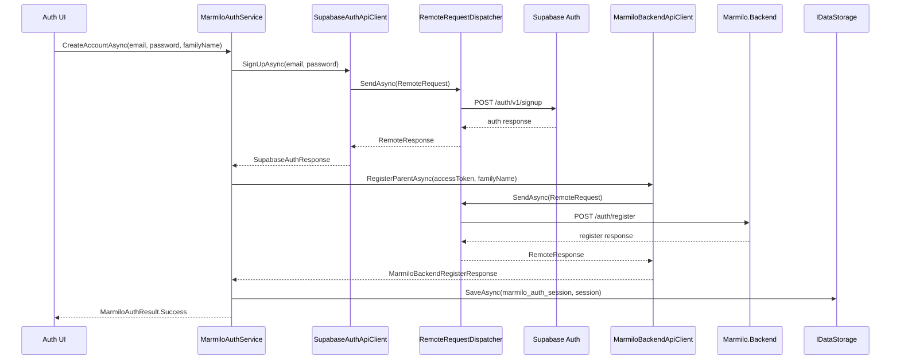

### Sequence: Profiles Refresh / Create / Delete

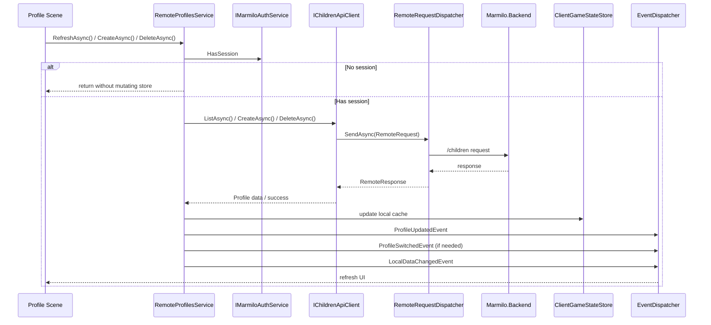

### Notes

- `RemoteRequestDispatcher` is intentionally generic and reusable.
- It handles:
  - request marshalling
  - bounded concurrency
  - retries through `IRemoteRetryPolicy`
  - HTTP transport using `UnityWebRequest`
- Game logic should not know about `UnityWebRequest`.
- The current migration keeps `DataRepository` alive, but new server-backed slices should ideally go through app services like `RemoteProfilesService`.

## 2. Controller-View Pattern

The Unity app mostly uses a pragmatic controller-view split:

- Scene entry points inherit from `SceneBase`
- Scene controllers orchestrate initialization and flows
- View components hold serialized references and visual behavior
- Some scenes split "logic controller" and "view controller" explicitly

### Main Classes

- [RoomSceneController.cs](/Volumes/DiegoMac2/Diego/projects/Brush/Assets/Scripts/Game/Unity/RoomScene/Controllers/RoomSceneController.cs)
- [RoomController.cs](/Volumes/DiegoMac2/Diego/projects/Brush/Assets/Scripts/Game/Unity/RoomScene/Controllers/RoomController.cs)
- [RoomViewController.cs](/Volumes/DiegoMac2/Diego/projects/Brush/Assets/Scripts/Game/Unity/RoomScene/Controllers/RoomViewController.cs)
- [RoomInventoryView.cs](/Volumes/DiegoMac2/Diego/projects/Brush/Assets/Scripts/Game/Unity/RoomScene/Inventory/RoomInventoryView.cs)
- [ProfileSelectionScene.cs](/Volumes/DiegoMac2/Diego/projects/Brush/Assets/Scripts/Game/Unity/ProfileSelectionScene/ProfileSelectionScene.cs)
- [ProfileManagementScene.cs](/Volumes/DiegoMac2/Diego/projects/Brush/Assets/Scripts/Game/Unity/ProfileManagementScene/ProfileManagementScene.cs)

### Class Diagram

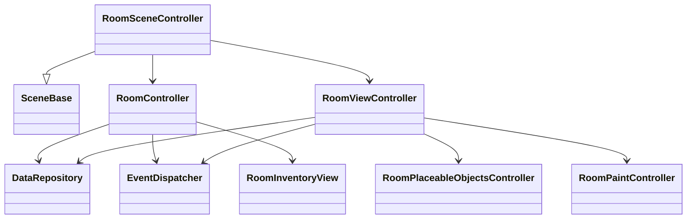

### Sequence: Room Scene Initialization

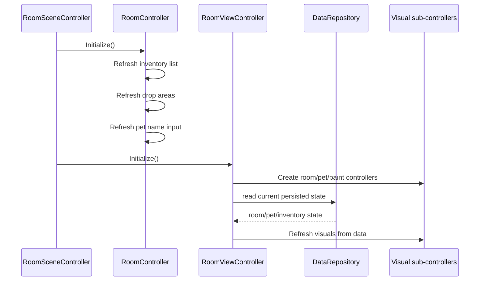

### Practical Pattern

- `RoomController` handles input, UI coordination, navigation, and dispatching gameplay intent.
- `RoomViewController` applies already-persisted state to visual surfaces.
- `DataController` listens to events and writes mutations into `DataRepository`.

That gives a useful separation:

- Interaction -> `RoomController`
- Mutation bridge -> `DataController`
- Visual refresh -> `RoomViewController`

## 3. Asset Loading

The good architectural decision here is already in place: the game depends on `IAssetLoader`, not directly on Addressables.

### Main Classes

- [IAssetLoader.cs](/Volumes/DiegoMac2/Diego/projects/Brush/Assets/Scripts/Utilities/Unity/AssetLoader/IAssetLoader.cs)
- [AddressablesAssetLoader.cs](/Volumes/DiegoMac2/Diego/projects/Brush/Assets/Scripts/Utilities/Unity/AssetLoader/AddressablesAssetLoader.cs)
- [IAssetLoadHandle.cs](/Volumes/DiegoMac2/Diego/projects/Brush/Assets/Scripts/Utilities/Unity/AssetLoader/IAssetLoadHandle.cs)
- [AddressablesAssetLoadHandle.cs](/Volumes/DiegoMac2/Diego/projects/Brush/Assets/Scripts/Utilities/Unity/AssetLoader/AddressablesAssetLoadHandle.cs)
- [ItemViewRenderer.cs](/Volumes/DiegoMac2/Diego/projects/Brush/Assets/Scripts/Game/Unity/RoomScene/ItemViews/ItemViewRenderer.cs)

### Class Diagram

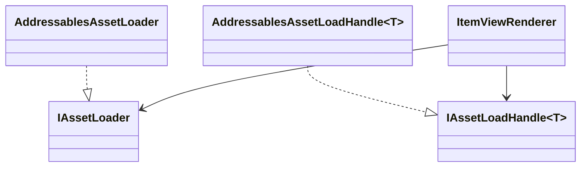

### Sequence: Load Item Sprite

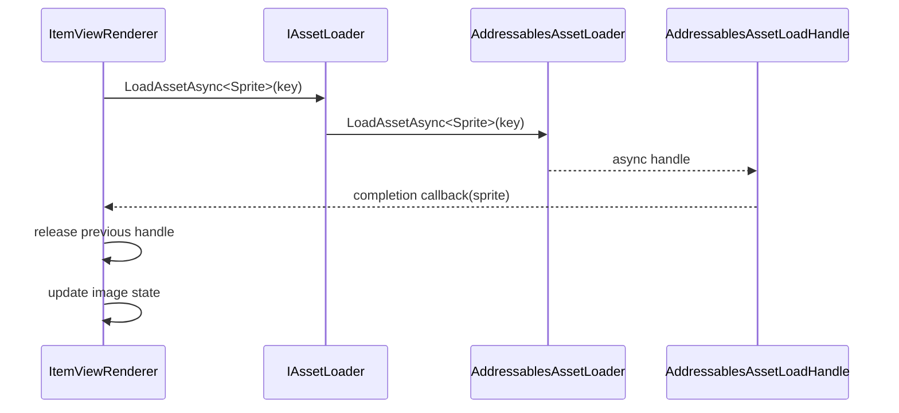

### Why This Matters

- The game layer does not know about `Addressables`.
- Missing/released asset handling is centralized in `ItemViewRenderer`.
- Evolving from a simple `LoadAssetAsync` API to preload/release/catalog refresh later is incremental.

## 4. Scene Navigation

Navigation is two-layered:

- `NavigationService` is generic and works with scenes and prefab popups.
- `GameNavigationService` adds game-level rules like screen blocking, queuing, and scene-specific events.

### Main Classes

- [INavigationService.cs](/Volumes/DiegoMac2/Diego/projects/Brush/Assets/Scripts/Utilities/Unity/Navigation/Abstractions/INavigationService.cs)
- [NavigationService.cs](/Volumes/DiegoMac2/Diego/projects/Brush/Assets/Scripts/Utilities/Unity/Navigation/Core/NavigationService.cs)
- [IGameNavigationService.cs](/Volumes/DiegoMac2/Diego/projects/Brush/Assets/Scripts/Game/Unity/Scenes/IGameNavigationService.cs)
- [GameNavigationService.cs](/Volumes/DiegoMac2/Diego/projects/Brush/Assets/Scripts/Game/Unity/Scenes/GameNavigationService.cs)
- [SceneBase.cs](/Volumes/DiegoMac2/Diego/projects/Brush/Assets/Scripts/Game/Unity/Scenes/SceneBase.cs)
- [SceneNavigationNodeResolver.cs](/Volumes/DiegoMac2/Diego/projects/Brush/Assets/Scripts/Game/Unity/Scenes/SceneNavigationNodeResolver.cs)
- [SceneSettings.cs](/Volumes/DiegoMac2/Diego/projects/Brush/Assets/Scripts/Game/Unity/Scenes/SceneSettings.cs)

### Class Diagram

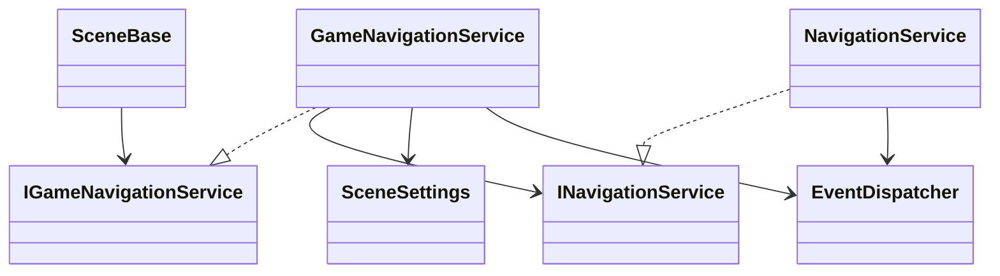

### Sequence: Navigate to a Scene

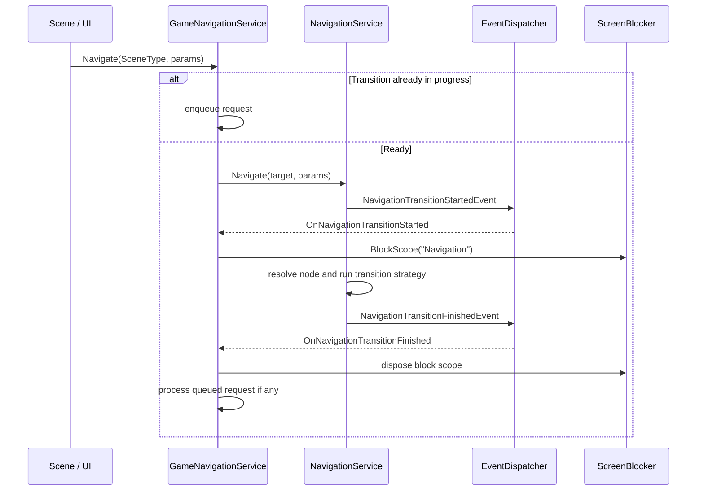

### Notes

- `SceneBase` gets `EventDispatcher` and `IGameNavigationService` injected.
- `NavigationService` can navigate both full scenes and popup prefabs.
- `GameNavigationService` serializes scene navigation requests and prevents overlapping transitions.

## 5. Zenject and Instantiators

There are two separate ideas here:

- Zenject composes the runtime graph.
- Instantiators decide whether a prefab is created with plain Unity or through Zenject injection.

### Main Classes

- [GameProjectInstaller.cs](/Volumes/DiegoMac2/Diego/projects/Brush/Assets/Scripts/Game/Unity/Installers/GameProjectInstaller.cs)
- [GameProjectComposition.cs](/Volumes/DiegoMac2/Diego/projects/Brush/Assets/Scripts/Game/Unity/Installers/GameProjectComposition.cs)
- [IObjectInstantiator.cs](/Volumes/DiegoMac2/Diego/projects/Brush/Assets/Scripts/Utilities/Unity/Instantiator/IObjectInstantiator.cs)
- [UnityInstantiator.cs](/Volumes/DiegoMac2/Diego/projects/Brush/Assets/Scripts/Utilities/Unity/Instantiator/UnityInstantiator.cs)
- [DependencyObjectInstantiator.cs](/Volumes/DiegoMac2/Diego/projects/Brush/Assets/Scripts/Game/Unity/Instantiator/DependencyObjectInstantiator.cs)
- [InstantiatorIds.cs](/Volumes/DiegoMac2/Diego/projects/Brush/Assets/Scripts/Game/Unity/Definitions/InstantiatorIds.cs)

### Class Diagram

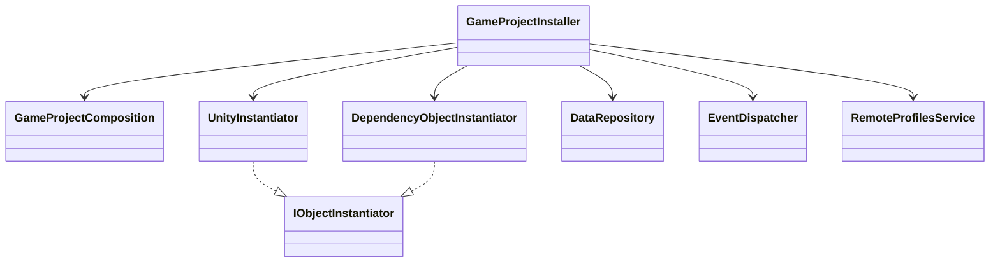

### Sequence: Application Bootstrap

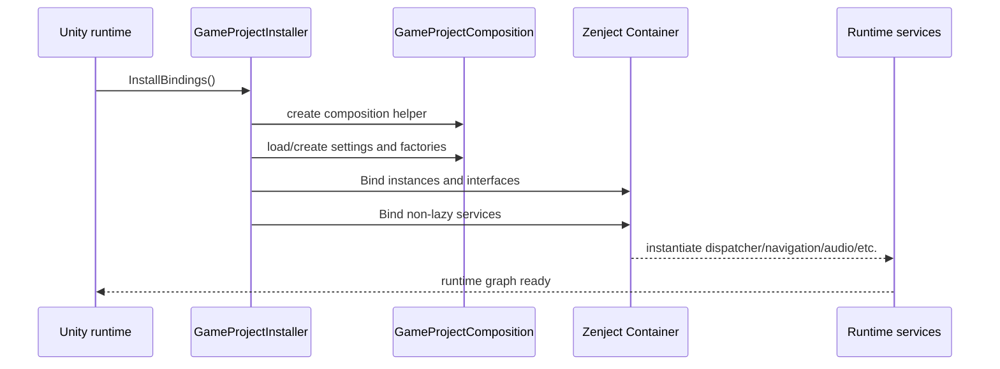

### Why Two Instantiators?

- `UnityInstantiator` is for plain prefab creation.
- `DependencyObjectInstantiator` routes prefab creation through Zenject, so the created prefab gets injection.

This is especially useful for visual objects that need services or factories after instantiation.

## 6. Drag and Drop

Drag-and-drop is built as reusable infrastructure in `Utilities`, then specialized in the room scene.

### Main Classes

- [UIDraggable.cs](/Volumes/DiegoMac2/Diego/projects/Brush/Assets/Scripts/Utilities/Unity/DragAndDrop/UIDraggable.cs)
- [UIDropTarget.cs](/Volumes/DiegoMac2/Diego/projects/Brush/Assets/Scripts/Utilities/Unity/DragAndDrop/UIDropTarget.cs)
- [UIDragScrollRouter.cs](/Volumes/DiegoMac2/Diego/projects/Brush/Assets/Scripts/Utilities/Unity/DragAndDrop/UIDragScrollRouter.cs)
- [RoomInventoryDraggable.cs](/Volumes/DiegoMac2/Diego/projects/Brush/Assets/Scripts/Game/Unity/RoomScene/DragItems/RoomInventoryDraggable.cs)
- [RoomPlacedObjectDraggable.cs](/Volumes/DiegoMac2/Diego/projects/Brush/Assets/Scripts/Game/Unity/RoomScene/DragItems/RoomPlacedObjectDraggable.cs)
- [RoomDropArea.cs](/Volumes/DiegoMac2/Diego/projects/Brush/Assets/Scripts/Game/Unity/RoomScene/DragItems/RoomDropArea.cs)
- [RoomInventoryDragData.cs](/Volumes/DiegoMac2/Diego/projects/Brush/Assets/Scripts/Game/Unity/RoomScene/DragItems/RoomInventoryDragData.cs)

### Class Diagram

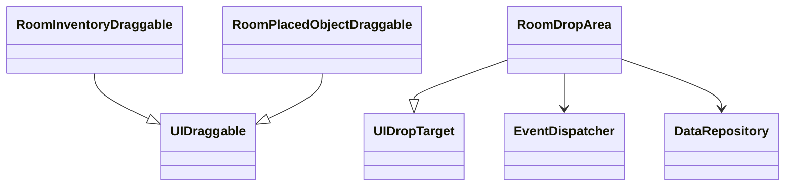

### Sequence: Drag Inventory Item into Room

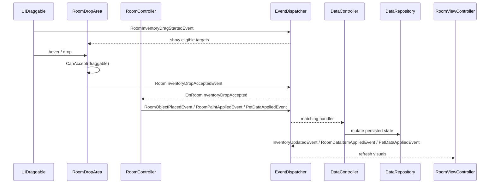

### Design Observation

This is a strong pattern in the project:

- generic infrastructure in `Utilities`
- game-specific policy in `Game.Unity`

## 7. EventDispatcher

`EventDispatcher` is one of the central architectural pieces of the client.

It is used for:

- gameplay mutation requests
- visual refresh notifications
- navigation transition notifications
- drag-and-drop lifecycle
- room inventory UX

### Main Classes

- [EventDispatcher.cs](/Volumes/DiegoMac2/Diego/projects/Brush/Assets/Scripts/Utilities/Core/Events/EventDispatcher.cs)
- [DataController.cs](/Volumes/DiegoMac2/Diego/projects/Brush/Assets/Scripts/Game/Core/DataController/DataController.cs)
- [RoomController.cs](/Volumes/DiegoMac2/Diego/projects/Brush/Assets/Scripts/Game/Unity/RoomScene/Controllers/RoomController.cs)
- [RoomViewController.cs](/Volumes/DiegoMac2/Diego/projects/Brush/Assets/Scripts/Game/Unity/RoomScene/Controllers/RoomViewController.cs)

### Class Diagram

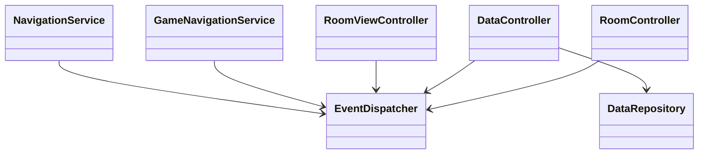

### Sequence: Event-Driven Mutation Loop

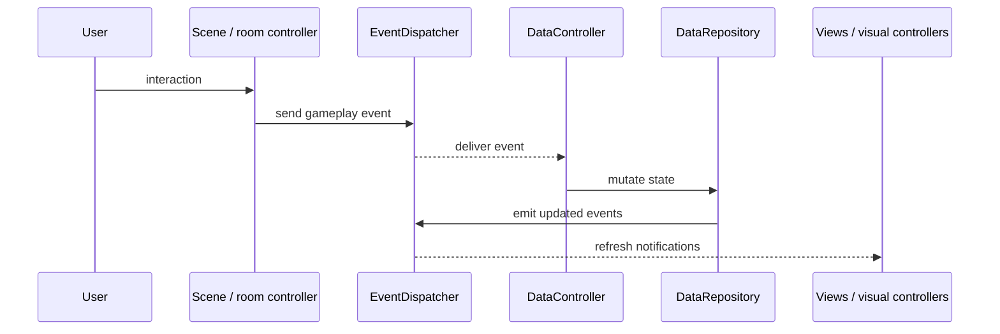

### Sender-Specific Events

`EventDispatcher` supports:

- global subscriptions by event type
- sender-specific subscriptions by `(event type, sender)`

That makes it flexible enough for broad app-level events and also for more local coordination.

## 8. Data and State Today

The current state model is transitional.

### Main Classes

- [Data.cs](/Volumes/DiegoMac2/Diego/projects/Brush/Assets/Scripts/Game/Core/Data/Data.cs)
- [ClientGameStateStore.cs](/Volumes/DiegoMac2/Diego/projects/Brush/Assets/Scripts/Game/Core/Services/ClientGameStateStore.cs)
- [DataRepository.cs](/Volumes/DiegoMac2/Diego/projects/Brush/Assets/Scripts/Game/Core/Services/DataRepository.cs)
- [IProfileService.cs](/Volumes/DiegoMac2/Diego/projects/Brush/Assets/Scripts/Game/Core/Services/IProfileService.cs)
- [LocalProfileService.cs](/Volumes/DiegoMac2/Diego/projects/Brush/Assets/Scripts/Game/Core/Services/LocalProfileService.cs)
- [IProfilesService.cs](/Volumes/DiegoMac2/Diego/projects/Brush/Assets/Scripts/Game/Core/Services/IProfilesService.cs)
- [RemoteProfilesService.cs](/Volumes/DiegoMac2/Diego/projects/Brush/Assets/Scripts/Game/Core/Services/RemoteProfilesService.cs)

### Class Diagram

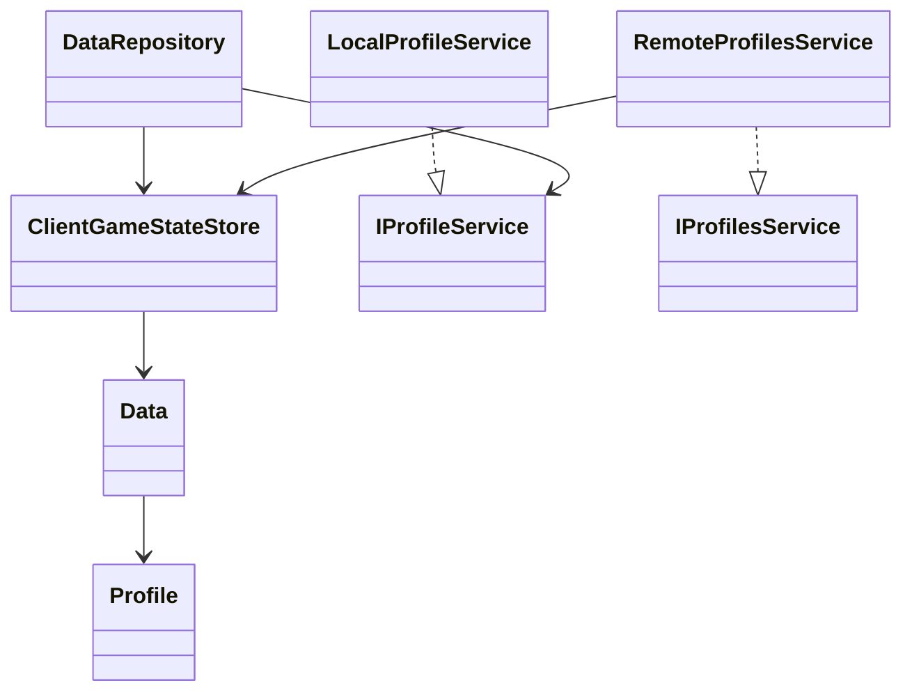

### Current Direction

- `DataRepository` is no longer the ideal final shape.
- `ClientGameStateStore` is the more accurate concept for local client state.
- `IProfileService` is still a local transitional service used by `DataRepository`.
- `IProfilesService` is the server-backed path now used by profile scenes.

This is the pattern to repeat for other areas:

- `economy`
- `market`
- `child_game_state`

## 9. Recommended Mental Model

When working in this repo, this is the safest mental model:

- `Utilities` contains reusable infrastructure
- `Game.Core` contains app/domain-side state and orchestration
- `Game.Unity` contains Unity-specific presentation and scene behavior
- `Marmilo.Backend` is becoming the source of truth for business logic

### Final Direction

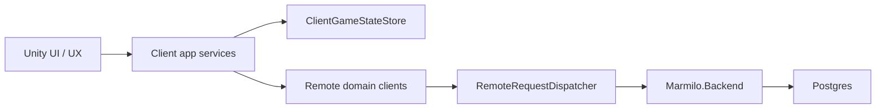

In that future shape:

- Unity owns presentation
- the backend owns rules and persistence
- local client data becomes cache/state for UX, not source of truth

## 10. What Is Still in Transition

This is important so the current architecture is interpreted correctly:

- `profiles` already have a server-backed client slice
- many other gameplay mutations still go through local `DataRepository`
- `DataController` still translates many scene events into local repository mutations
- `brushSessionDurationMinutes` is still local in the client
- room/pet/inventory visual state is still applied from local client state

So the codebase is not yet "fully server-first", but the architectural direction is already clear and the first vertical is in place.
